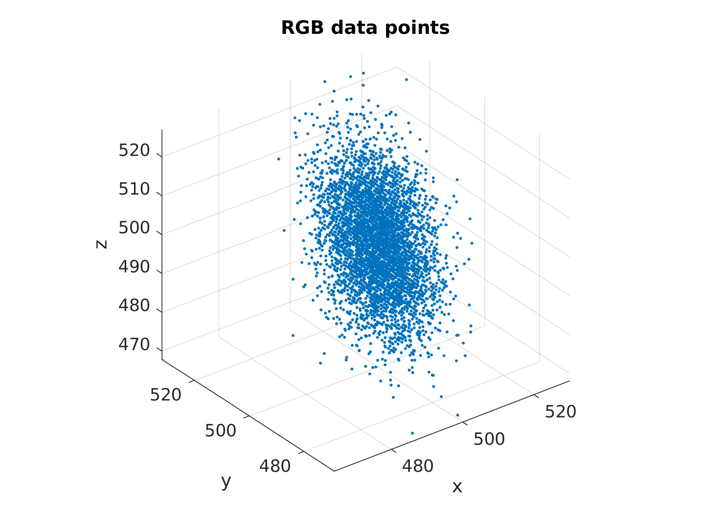
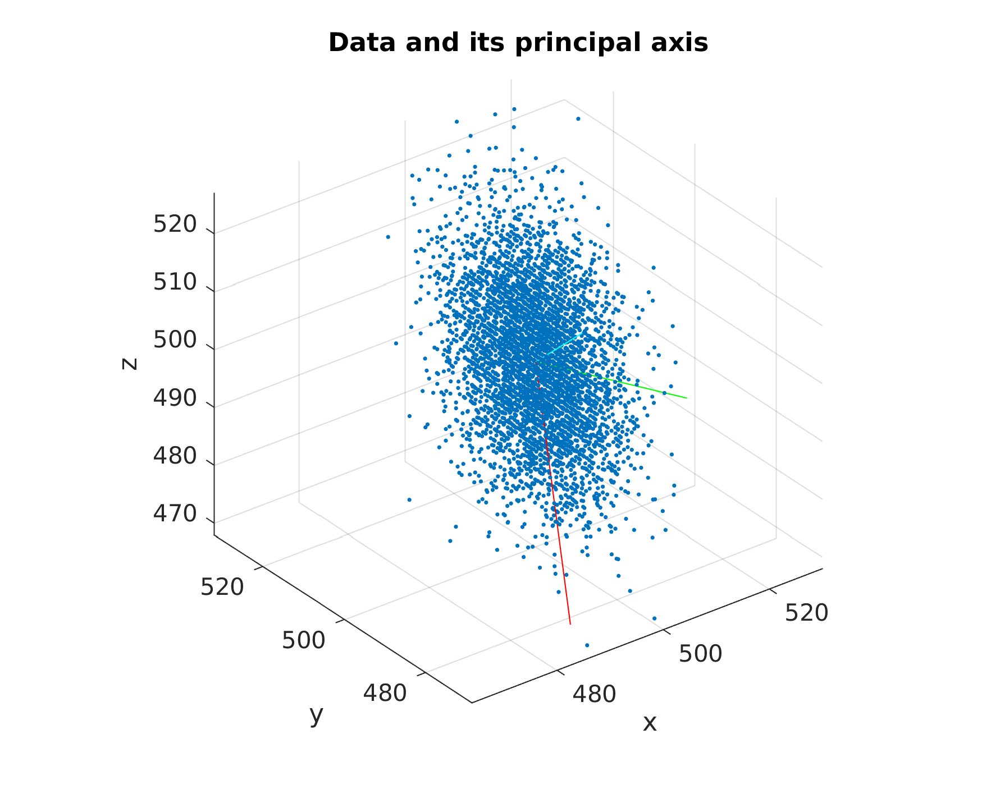
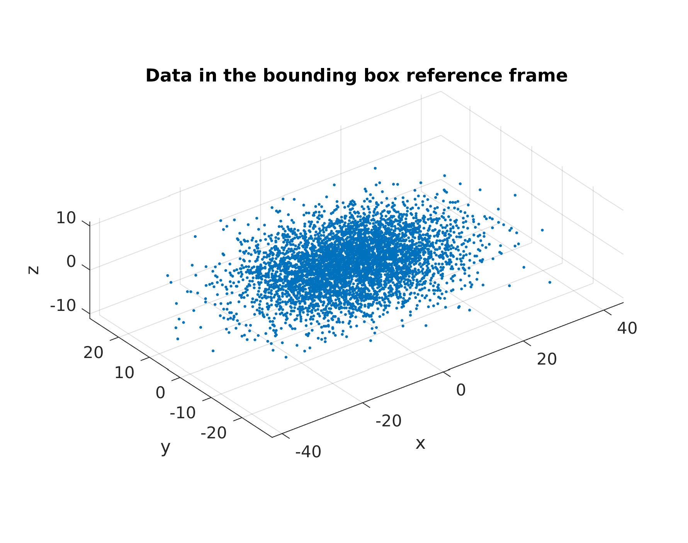
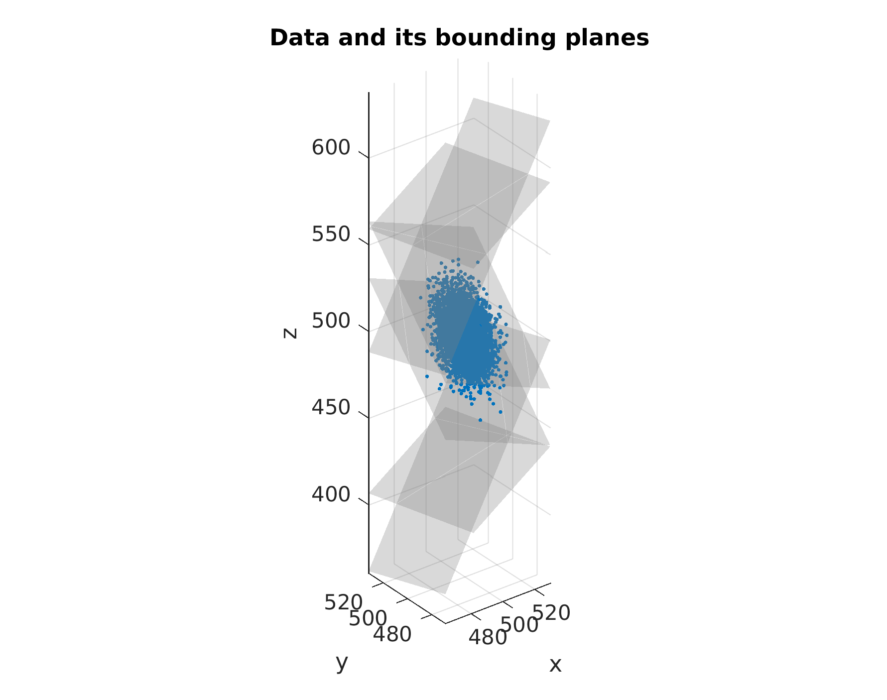

# minimum-bounding-box

A Matlab function that calculates the minimum bounding box in a R^N Cartesian space.
The bounding box is defined by the 2N hyperplane equations. 
The code uses the Singular Value Decomposition (SVD) to compute the principal axes.

A demo is provided to show how to interface with the function and visualizing sample data.
Note that the demo script has a fixed random seed for replicability by the user.
Change the seed or comment out the line:

> rng(1234);

to get different sample data.

#### Demo Images

*Figure 1:*

 

*Figure 2:*

 

*Figure 3:*

 

*Figure 4:*

 

